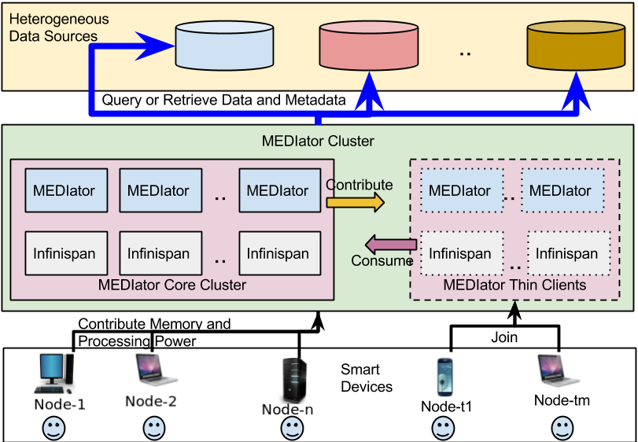

.. MEDIator documentation master file, created by
   sphinx-quickstart on Thursday July 21, 2016.
   You can adapt this file completely to your liking, but it should at least
   contain the root `toctree` directive.

**********************************
MEDIator - Data Replication System
**********************************

Welcome to the MEDIator Documentation. Here you will find information describing the features of the MEDIator platform,
tips on how to use it, and details about its RESTful API.

With the growing adaptation of pervasive computing into medical domain and increasingly open access to data, metadata
stored in medical image archives and legacy data stores is shared and synchronized across multiple devices of data consumers.
While many medical image sources provide APIs for public access, an architecture that orchestrates an effective sharing
and synchronization of metadata across multiple users, from different storage media and data sources, is still lacking.

MEDIator is a data sharing and synchronization middleware platform for heterogeneous medical image archives.
MEDIator allows sharing pointers to medical data efficiently, while letting the consumers manipulate the pointers
without modifying the raw medical data. MEDIator has been implemented for multiple data sources, including Amazon S3,
The Cancer Imaging Archive (TCIA), caMicroscope, and metadata from CSV files for cancer images.

This documentation is intended to serve both the MEDIator developers/deployers as well as the MEDIator users. Please
note that MEDIator version 1.0 has been code named SPREAD (System for Sharing and Publishing Research Data). You may
find sentences referring to MEDIator by this code name.

Getting Started With MEDIator
#############################

You may download and build MEDIator from its source code, which is readily avilable at

https://bitbucket.org/BMI/datareplicationsystem/

There is also a containerized version of MEDIator available at,

https://hub.docker.com/r/datacafe/mediator/

However, please note that the MEDIator container can often be an outdated version. So it is recommended to clone
MEDIator source code and build it with Maven.

The source code of this documentation can be found at,
https://github.com/pradeeban/mediator

This documentation is currently hosted at,
http://mediator.readthedocs.io/

MEDIator Research
#################

.. toctree::
   :maxdepth: 2

   sections/Usecase
   sections/About-MEDIator

MEDIator for Users
##################

.. toctree::
   :maxdepth: 2

   sections/Interfaces
   sections/MEDIator-REST-API
   sections/Web-Application

MEDIator for Developers
#######################

.. toctree::
   :maxdepth: 2

   sections/Development
   sections/Deployment
   sections/API-Gateway
   sections/Installation-CENTOS
   sections/Data-Sources

Citing MEDIator
###############

If you have used MEDIator in your research, please cite the below papers:

[1] Kathiravelu, P. & Sharma, A. (2015). **MEDIator: A Data Sharing Synchronization Platform for Heterogeneous Medical Image Archives.**
In *Workshop on Connected Health at Big Data Era (BigCHat'15), co-located with 21st ACM SIGKDD Conference on Knowledge Discovery and Data Mining (KDD 2015)*.
Aug. 2015. ACM. 6 pages. http://doi.org/10.13140/RG.2.1.3709.4248

[2] Kathiravelu, P. & Sharma, A. (2016). **SPREAD - System for Sharing and Publishing Research Data**. In *Society for Imaging
Informatics in Medicine Annual Meeting (SIIM 2016)*. June 2016.
http://c.ymcdn.com/sites/siim.org/resource/resmgr/siim2016abstracts/Research_Kathiravelu.pdf
