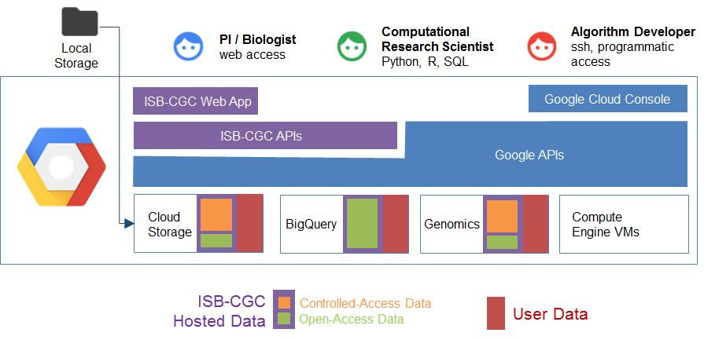

.. ISB-CGC documentation master file, created by
   sphinx-quickstart on Sun Dec 20 11:20:02 2015.
   You can adapt this file completely to your liking, but it should at least
   contain the root `toctree` directive.

***********************************
 MEDIator - Data Replication System
***********************************

Welcome to the MEDIator Documentation on Read the Docs.

Here you will find information describing the features of the MEDIator platform,
tips on how to use it, and details about its RESTful API.

With the growing adaptation of pervasive computing into medical domain and increasingly open access to data, metadata
stored in medical image archives and legacy data stores is shared and synchronized across multiple devices of data consumers.
While many medical image sources provide APIs for public access, an architecture that orchestrates an effective sharing
and synchronization of metadata across multiple users, from different storage media and data sources, is still lacking.

MEDIator is a data sharing and synchronization middleware platform for heterogeneous medical image archives.
MEDIator allows sharing pointers to medical data efficiently, while letting the consumers manipulate the pointers
without modifying the raw medical data. MEDIator has been implemented for multiple data sources, including Amazon S3,
The Cancer Imaging Archive (TCIA), caMicroscope, and metadata from CSV files for cancer images.

** Citing MEDIator **
If you have used MEDIator in your research, please cite the below paper:

Kathiravelu, P. & Sharma, A. (2015). **MEDIator: A Data Sharing Synchronization Platform for Heterogeneous Medical Image Archives.**
In *Workshop on Connected Health at Big Data Era (BigCHat'15), co-located with 21st ACM SIGKDD Conference on Knowledge Discovery and Data Mining (KDD 2015)*.
Aug. 2015. ACM. 6 pages. http://doi.org/10.13140/RG.2.1.3709.4248

Contents
########

.. toctree::
   :maxdepth: 1

   sections/About-ISB-CGC
   sections/Hosted-Data
   sections/Prog-APIs
   sections/Web-UI
   sections/QuicklinksOneTable
   sections/DIYWorkshop
   sections/FAQ
   sections/Support

