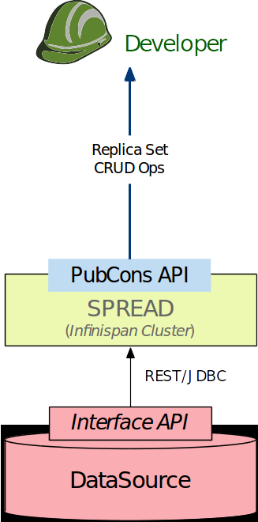

.. MEDIator documentation master file, created by
   sphinx-quickstart on Thursday July 21, 2016.
   You can adapt this file completely to your liking, but it should at least
   contain the root `toctree` directive.

*******************************************
MEDIator - Data Replication System for TCIA
*******************************************

MEDIator is a data sharing and synchronization middleware platform for heterogeneous medical image archives.
MEDIator allows sharing pointers to medical data efficiently, while letting the consumers manipulate the pointers
without modifying the raw medical data. MEDIator has been implemented for multiple data sources, including Amazon S3,
The Cancer Imaging Archive (TCIA), caMicroscope, and metadata from CSV files for cancer images.

Please note that MEDIator version 1.0 has been code named SPREAD (System for Sharing and Publishing Research Data). You
may find sentences referring to MEDIator by this code name.

This MEDIator deployment focuses on TCIA as its core data source.

Getting Started With MEDIator
#############################

Sign up with the developer portal to get your own access key to MEDIator.

Use your keys to invoke the MEDIator REST API.

.. toctree::
      :maxdepth: 1

       sections/restapi/Create
       sections/restapi/Retrieve
       sections/restapi/Update
       sections/restapi/Delete

Citing MEDIator
###############

If you have used MEDIator in your research, please cite the below papers:

[1] Kathiravelu, P. & Sharma, A. (2015). **MEDIator: A Data Sharing Synchronization Platform for Heterogeneous Medical Image Archives.**
In *Workshop on Connected Health at Big Data Era (BigCHat'15), co-located with 21st ACM SIGKDD Conference on Knowledge Discovery and Data Mining (KDD 2015)*.
Aug. 2015. ACM. 6 pages. http://doi.org/10.13140/RG.2.1.3709.4248

[2] Kathiravelu, P. & Sharma, A. (2016). **SPREAD - System for Sharing and Publishing Research Data**. In *Society for Imaging
Informatics in Medicine Annual Meeting (SIIM 2016)*. June 2016.
http://c.ymcdn.com/sites/siim.org/resource/resmgr/siim2016abstracts/Research_Kathiravelu.pdf
