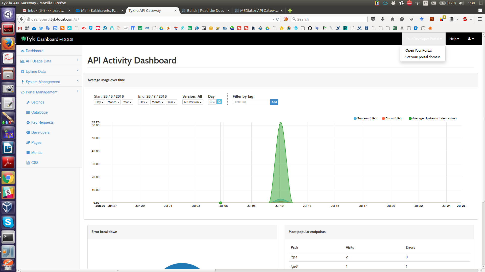

*******************************
MEDIator API Gateway and Portal
*******************************

MEDIator can also be deployed with API gateways and portals such as those offered by Tyk.

Setting up Tyk Portal for MEDIator
##################################

There was this long running bug that is hitting us from setting up the Tyk portal. The issue was with Tyk not allowing
custom domains from being set up as portal. While the settings as advised in Tyk mention the dashboard and portal port
as 3000, ideally it should be set as 80 to get the portal configured seamlessly.

**Setting up Portal Domain**

Add to /etc/hosts file:

127.0.0.1 dashboard.tyk-local.com

127.0.0.1 portal.tyk-local.com

Most probably Apache2 or some other web server would already be listening on the port 80. Make sure to stop it to
release the port.

*Stop Apache2 Web Server*

/etc/init.d/apache2 stop

**Configure Tyk Gateway**

sudo /opt/tyk-gateway/install/setup.sh --dashboard=http://dashboard.tyk-local.com --listenport=8080 --redishost=localhost --redisport=6379 --domain=""

**Configure Tyk Dashboard**

sudo /opt/tyk-dashboard/install/setup.sh --listenport=80 --redishost=localhost --redisport=6379 --mongo=mongodb://127.0.0.1/tyk_analytics --tyk_api_hostname=127.0.0.1 --tyk_node_hostname=http://127.0.0.1 --tyk_node_port=8080 --portal_root=/portal --domain="dashboard.tyk-local.com"

**Configure Tyk Pump**

sudo /opt/tyk-pump/install/setup.sh --redishost=localhost --redisport=6379 --mongo=mongodb://127.0.0.1/tyk_analytics

**Initial start to set up the Tyk license**

sudo service tyk-pump start

sudo service tyk-dashboard start

Access http://dashboard.tyk-local.com/ and add the license in the prompt.

**Restart the Tyk Dashboard and start the Tyk Gateway**

sudo service tyk-dashboard restart

sudo service tyk-gateway start

**Fix the Tyk bootstrap script to listen at port 80**

gedit /opt/tyk-dashboard/install/bootstrap.sh and remove :3000 from all the references, since we are going to use the default port 80, instead of port 3000 as the dashboard port.

#!/bin/bash

# Usage ./bootstrap.sh DASHBOARD_HOSTNAME

LOCALIP=$1

RANDOM_USER=$(env LC_CTYPE=C tr -dc "a-z0-9" &lt; /dev/urandom | head -c 10)

PASS="test123"

echo "Creating Organisation"

ORGDATA=$(curl --silent --header "admin-auth: 12345" --header "Content-Type:application/json" --data '{"owner_name": "Default Org.","owner_slug": "default", "cname_enabled": true, "cname": ""}' http://$LOCALIP/admin/organisations 2&gt;&amp;1)

#echo $ORGDATA

ORGID=$(echo $ORGDATA | python -c 'import json,sys;obj=json.load(sys.stdin);print obj["Meta"]')

echo "ORGID: $ORGID"

echo "Adding new user"

USER_DATA=$(curl --silent --header "admin-auth: 12345" --header "Content-Type:application/json" --data '{"first_name": "John","last_name": "Smith","email_address": "'$RANDOM_USER'@default.com","password":"'$PASS'", "active": true,"org_id": "'$ORGID'"}' http://$LOCALIP/admin/users 2&gt;&amp;1)

#echo $USER_DATA

USER_CODE=$(echo $USER_DATA | python -c 'import json,sys;obj=json.load(sys.stdin);print obj["Message"]')

echo "USER AUTH: $USER_CODE"

USER_LIST=$(curl --silent --header "authorization: $USER_CODE" http://$LOCALIP/api/users 2&gt;&amp;1)

#echo $USER_LIST

USER_ID=$(echo $USER_LIST | python -c 'import json,sys;obj=json.load(sys.stdin);print obj["users"][0]["id"]')

echo "NEW ID: $USER_ID"

echo "Setting password"

OK=$(curl --silent --header "authorization: $USER_CODE" --header "Content-Type:application/json" http://$LOCALIP/api/users/$USER_ID/actions/reset --data '{"new_password":"'$PASS'"}')

echo ""

echo "DONE"

echo "===="

echo "Login at http://$LOCALIP/"

echo "User: $RANDOM_USER@default.com"

echo "Pass: $PASS"

echo ""

**Save and exit the bootstrap script and execute it.**

sudo /opt/tyk-dashboard/install/bootstrap.sh dashboard.tyk-local.com

root@llovizna:/home/pradeeban#  sudo /opt/tyk-dashboard/install/bootstrap.sh dashboard.tyk-local.com

Creating Organisation

ORGID: 579794145ee8571e46000001

Adding new user

USER AUTH: 6936a780a8e448fd73e3d7ef64eb8059

NEW ID: 5797941458149ac06a14e801

Setting password

DONE

====

Login at http://dashboard.tyk-local.com/

User: c9og13fnc8@default.com

Pass: test123

**Tyk Identity Broker (TIB)**

In order to enable TIB, you need to do some more steps.

In /opt/tyk-dashboard/tyk_analytics.conf

    "identity_broker": {

        "enabled": true,

        "host": {

            "connection_string": "http://localhost:3010",

            "secret": "934893845123491238192381486djfhr87234827348"

        }

    },

Make sure the shared secrets match in tyk-analytics.conf and tib.conf of TIB.
https://tyk.io/docs/tyk-dashboard-v1-0/configuration/

{
    "Secret": "test-secret",

    "HttpServerOptions": {

        "UseSSL": false,

        "CertFile": "./certs/server.pem",

        "KeyFile": "./certs/server.key"

    },

	"BackEnd": {

		"Name": "in_memory",

        "ProfileBackendSettings": {},

		"IdentityBackendSettings": {

            "Hosts" : {

                "localhost": "6379"

            },

            "Password": "",

            "Database": 0,

            "EnableCluster": false,

            "MaxIdle": 1000,

            "MaxActive": 2000

        }

	},

	"TykAPISettings": {

        "GatewayConfig": {

            "Endpoint": "http://localhost",

            "Port": "8080",

            "AdminSecret": "12345"

        },

        "DashboardConfig": {

            "Endpoint": "http://dashboard.tyk-local.com",

            "Port": "80",

            "AdminSecret": "12345"

        }

    }

}

**Enable TIB in the Tyk Analytics Configurations**

Modify the TIB configurations in /opt/tyk-dashboard/tyk_analytics.conf as below:

    "identity_broker": {

        "enabled": true,

        "host": {

            "connection_string": "http://127.0.0.1:3010",

            "secret": "test-secret"

        }

    },

**Enable Email Notifications in the Tyk Analytics Configurations**

    "email_backend": {

        "enable_email_notifications": true,

        "code": "",

        "settings": null,

        "default_from_email": "",

        "default_from_name": ""

    },

**Execute TIB**

You will have to restart everything after configuring the TIB.

sudo service tyk-pump restart

sudo service tyk-dashboard restart

sudo service tyk-gateway restart

From the TIB home directory, /tib

**Tyk Developer Portal**

Now you are good to log in to the Tyk Dashboard with the given credentials.

**Set Portal domain**

portal.tyk-local.com

This would give a message, "CNAME updated"

Now if you access http://portal.tyk-local.com/portal/ it would say "Home page not found". This is expected as you have not set up the portal and the welcome page yet.

Follow the below document to get this set up.

https://tyk.io/docs/tyk-api-gateway-v1-9/tutorials/set-up-your-portal/#step-6-set-your-portal-hostname:b4a940a28f68aca0b7fe0e28e62b2736

Once you have set this up, your portal is ready for the developers to register, log in, and consumes the APIs defined in the API catalogue.

**Find the logs**

    sudo tail -f /var/log/upstart/tyk-dashboard.log

    sudo tail -f /var/log/upstart/tyk-gateway.log

    sudo tail -f /var/log/upstart/tyk-pump.log