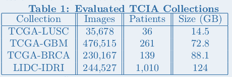

******************************************************
Introduction to the MEDIator Data Replication Platform
******************************************************

This page is intended to give an overall idea and the motivation behind the inception of MEDIator platform.

Introduction
############

Radiomics and Radiogenomics research requires large amounts of well curated, high quality, imaging and
genomic data. The typical workflow involves downloading the data from a public repository, or the data
warehouse of the data coordination site, and processing and analyzing the data on local compute clusters. As
new data is added by the data providers, it is often left to the individual investigator to track and download
new data. Since these research studies are often multi-investigator, research groups often designate a point-
person as the local ‘project-specific’ data disseminators, who in turn set local databases/spreadsheets/
dropbox accounts to track the data downloads. This rather inefficient and error-prone workflow is necessary
because there are no good systems to share data amongst investigators and collaborators. Finally, upon
conclusion of study, investigators rarely have a good way to identify the specific subset of data (from the
centralized repository/DCC) that was used in their project. In the absence of a good way to publish their
data, it becomes difficult to reproduce scientific studies.

The purpose of this project was to develop a system that could provide data repositories and DCC with a
seamless, and transparent, approach to give their users the ability to share and publish research data — a
one-way Dropbox like environment for the community which gives researchers the ability to share data
subsets, track and download updates, and publish data.

Methods
#######

The primary design construct of MEDIator is a system for the creation, access and update of replica sets.
Replica sets can be thought of as pointers that consist of metadata-tuples that can be used to uniquely
identify and point to data. It points to a chosen subset of data, that is stored in one or more homogeneous/
heterogeneous data sources. When using replica sets, no raw data is duplicated, and only the pointers to the
data are shared. Data consumers share the identifiers among the other interested data consumers. Replica
sets and identifiers are stored in a distributed storage offered by MEDIator. As the data and execution is
distributed among multiple computing nodes, parallel execution of thousands of queries are enabled
without a performance degrade.

Data providers are responsible for identifying metadata that is used to describe and access the raw data.
Existing replica sets can be updated for each of the data sources, at the specified granularity of metadata.

While only the data consumers with the credentials (often those who created the replica set) can expose,
update, or delete the existing replica sets, public replica sets can be duplicated by the other consumers.
MEDIator data replication mechanism consists of 3 APIs: a) An Interface API provides a generic interface that
can be used by a data provider, or a DCC, to integrate with their data management system. The
implementation of this interface is used to query the metadata and retrieve the raw data. b) A PubCons API
that can be used by data consumers, to help create, update, and delete replica sets, at varying granularity. c)
An Integrator API that integrates data, and allows replica sets to be created from multiple data sources. Each
replica set is represented as a hierarchical tree structure where each data source is mapped as a sub-tree.
Leaves of the tree point to metadata at different granularity. Multiple homogeneous data sources can
leverage a single implementation of the PubCons API, where heterogeneous data sources are integrated as
sub trees of the replica set by invoking the relevant implementation of PubCons API for each of the data
source.

We also provide an SDK to enable the creation of replica sets effectively through native Java and Python
interfaces. This allows developers, of platforms such as 3DSlicer (a medical imaging research workstation)
and Galaxy, to easily integrate the data sharing capability into their respective applications. Such native
access allows their users to exchange data amongst collaborators without explicitly moving large amounts of
data.

Finally, we provide users the ability to publish a replica set and associate it with a Digital Object Identifier. A
published replica-set is immutable, and the act of publishing makes the replica-set read-only. Before a DOI
can be generated, the publisher is also prompted to provide some metadata.

Evaluation
##########

MEDIator was tested against TCIA, Amazon S3, and both TCIA and Amazon S3 together. It was evaluated in a cluster up to 6
identical nodes of servers with Intel® CoreTM i7-2600K CPU @ 3.40GHz and 12 GB memory. Data sources up to 300 GB from
TCIA consisting of around 100000 image files and S3 were used in the evaluations.

Results
#######

The implementation demonstrates the extensibility and efficiency of MEDIator in integrating and sharing data
from multiple heterogeneous data source among the data consumers. As a sample data sharing scenario, we
deployed MEDIator against three heterogeneous biomedical image sources. The data sources were: a)
Radiology data from The Cancer Imaging Archive; b) digital pathology images in caMicroscope; and c)
sequence data that was stored in Amazon S3 buckets. While the genomic data was stored in S3 buckets, the
corresponding clinical data (used as metadata) was stored as CSV files.

TCIA and caMicroscope provide robust data management services, including a set of RESTful APIs are used to
query the images and the relevant metadata. The genomic data was stored as Amazon S3 blobs and linked to
metadata (clinical data) that was stored as CSV files. The CSV files themselves were integrated and queried
through CSVIntegrator, an implementation of IntegratorAPI to read and parse the CSV meta files. The meta
files were read and stored in the distributed in-memory grid of MEDIator for easy access to minimize the
performance overhead caused by the frequent disk access.

The pilot project used ~100000 image files and nearly 300GB of data. The result of this pilot project
illustrated the robustness of the MEDIator system in integrating multiple, diverse data sources (including a
cloud based data source), and provide users the ability to share subsets of data without an explicit download
of data.

Discussion
##########

In this project we present an extensible, and transparent system, that gives data publishers the ability to
allow their users to share data, without explicitly downloading and distributing data. Such a lightweight approach
provides ubiquitous access to medical metadata from the radiomics/radiogenomics archives, while
providing fault tolerance and load balancing, leveraging the distributed shared memory platforms. As new
data is added by data providers, replica sets can be easily updated. This allows consumers to access and
download only the data that was updated. Finally, we provide data consumers, the ability to ‘publish’ data
used in their studies. In this model of publishing data, a consumer does not upload data. Instead they
identify the data subset that was used in specific study. This model encourages reproducibility in science and
easier access to the data used in projects.

Conclusion
##########

The emerging research domains of radiomics and radiogenomics place a heavy emphasis on the need for
large scale, well curated information repositories. Our work demonstrates a novel approach to sharing and
accessing subsets of data stored in such repositories. Our motivating premise is that such novel mechanisms
to share data, will encourage data reuse, as well as streamline access to data from algorithms.

MEDIator is a platform for sharing medical images across multiple users by merely sharing the metadata, from the
heterogeneous image archives by leveraging the distributed shared memory platforms. The design can also be implemented
for any other data sources having an index to query and structure them as replica sets.

Tentative Action Items
######################

Public Release: Summer 2016 (TCIA)

Integrate with NIH Genomic Data Commons

Persist Replica Sets

Associate Digital Object Identifiers with Replica Sets