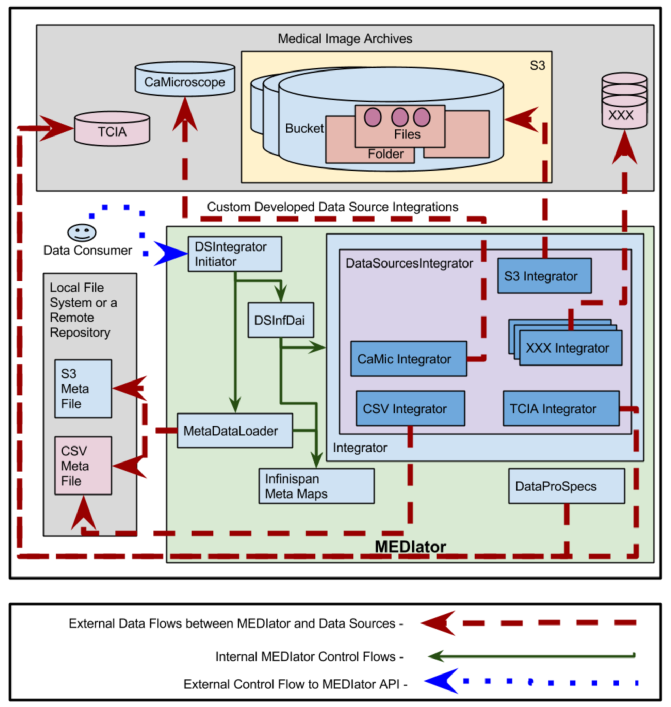
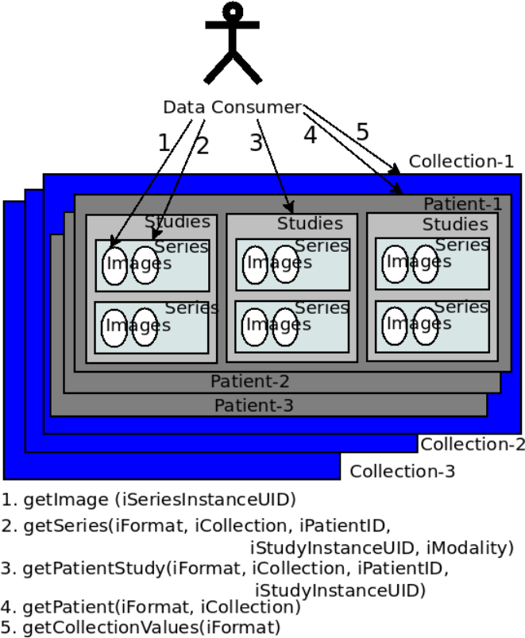

************
Data Sources
************

MEDIator version 1.0-SNAPSHOT has extensively been developed for The Cancer Imaging Archive (TCIA), while maintaining
relevant interfaces for extension to the otehr data sources.

Integration with Medical Data Sources
#####################################

Clinical data is deployed in multiple data sources such as TCIA, caMicroscope, and Amazon S3. The above figure depicts
the deployment of the system with multiple medical data sources. A set of clinical data was uploaded to S3, where the
metadata mapping of patientID \ding{213} fileName was available as a CSV file. Similarly CSV file depicting clinical
information is available, as multiple properties against the UUID, such as patient ID. These files are parsed and stored
 into metadata maps in Infinispan. The CSV files containing metadata or $resource ID \ding{213} fileName$ mapping are
 stored locally in the file system or in a remote repository.

Each data source is connected to MEDIator by implementing a class that extends Integrator interface.
DatasourcesIntegrator, an abstract class provides the common features for the data sources integration.
It is extended by CsvIntegrator, CaMicIntegrator, S3Integrator, and TciaIntegrator which respectively function as the
integrators for CSV, caMicroscope, Amazon S3, and TCIA. MetaDataLoader loads the CSV files and stores them into
Infinispan maps, against the ID, such as the patient ID.

A sub class of InfDataAccessIntegration, DSInfDai holds the instances of map to store all the metadata.
DSIntegratorInitiator invokes the instances of DSInfDai and MetaDataLoader to parse the metadata, and store the
instances into the respective maps.

Medical Image Archives
######################

Medical images are stored in specific data sources such as TCIA that defines a schema for the metadata, or can be stored
 in a general-purpose data source such as Amazon S3, with user-enforced schema. TCIA public API provides methods to
 retrieve the images and metadata of different granularity. These methods are invoked by the public APIs such as the
 REST API. An initial search on TCIA may contain parameters such as modality, in addition to collection name,
 patient ID, study instance ID, and series instance UID. Each of the searches in TCIA returns the output in a finer
 granularity.

TCIA is made of multiple collections. Collections are queried and raw image data and metadata are downloaded by users.
While some collections are open for public access, some are protected. Downloads create a considerable load in the
servers, with unexpected spikes resulting from automated bulk downloads. The National Lung Screening Trial (NLST) 2 has
a mean download rate of 0.5 TB/month, with a spike of 5.6 TB in June 2013, during the last 3 years.

Further Resources
#################

.. toctree::
    :maxdepth: 2

    datasources/Resources
    datasources/Acknowledgements

