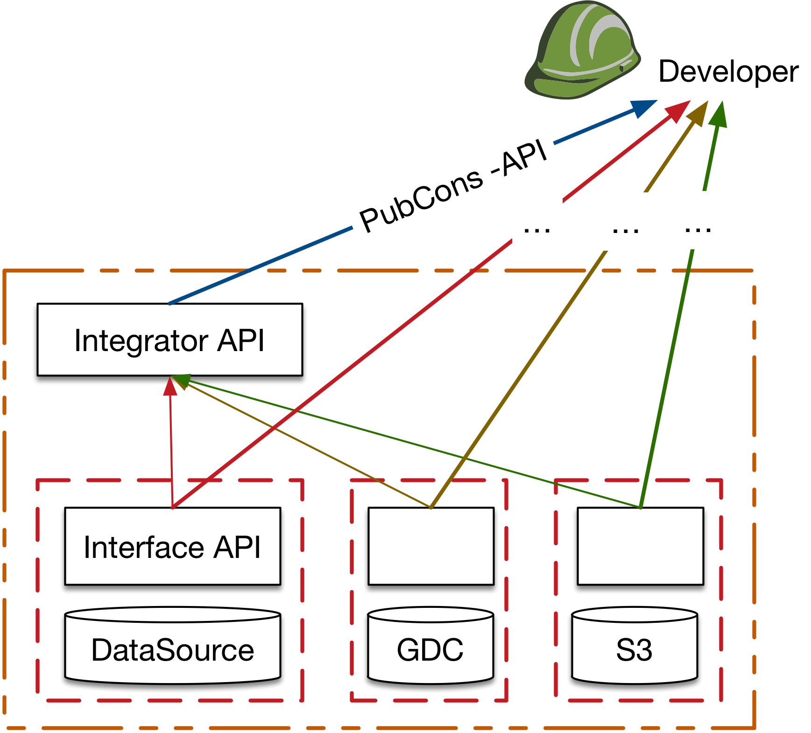

*******************
MEDIator Interfaces
*******************

MEDIator consists of 3 interfaces for data source management and replica set management. Data Source Management API
(Formerly known as Interface API) is an interface for retrieving data and metadata from the original data sources.
This is customized for each data source, though is often provided by the data source itself.

Replica Set Management API (Formerly known as PubCons API) is a public interface customized for each data source. It is
the core of MEDIator, for creating and managing replica sets.

In addition to these two, there is also an Integrator API that allows the developers to create and manage replica sets
that span across multiple heterogeneous data sources.

Infinispan in-memory data grid has been leveraged as the distributed storage and execution platform for MEDIator. It
minimizes performance overheads caused by disk access. Furthermore, current work-in-progress ensures no duplicate
downloads while ensuring duplicate detection across the locally downloaded data sets and the data source.

Core Interfaces of MEDIator
###########################

.. toctree::
   :maxdepth: 1

   interfaces/Data-Source-Mgmt
   interfaces/Replica-Set-Mgmt
   interfaces/Integrator

