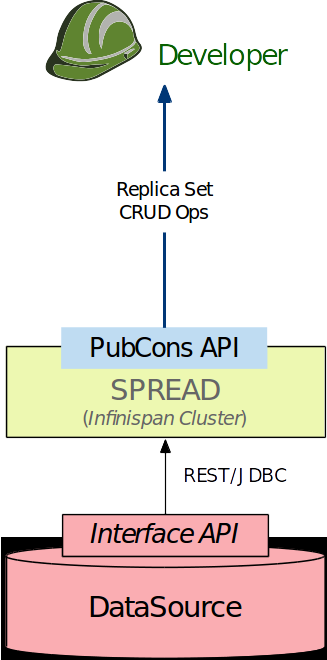

*********************
MEDIator RESTful APIs
*********************

If you are hosting MEDIator for public access, you need to start it and expose its RESTful APIs. Execute the
MEDIatorEngine class.

$ java -classpath lib/repl-server-1.0-SNAPSHOT.jar:lib/*:conf/ edu.emory.bmi.datarepl.core.MEDIatorEngine

You may get it running with nohup:

$ nohup java -classpath lib/repl-server-1.0-SNAPSHOT.jar:lib/*:conf/ edu.emory.bmi.datarepl.core.MEDIatorEngine &

To add more instances to the cluster, start the instances of Initiator class.
$ java -classpath lib/repl-server-1.0-SNAPSHOT.jar:lib/*:conf/ edu.emory.bmi.datarepl.core.Initiator

The implementation of the RESTful invocations can be found at TciaReplicaSetManager.

You may access MEDIator's RESTful APIs directly or through your application that consumes the MEDIator APIs.

You may extend or leverage the exposed APIs. To begin with, you may consume the MEDIator RESTful APIs through a REST
client such as the Postman plugin of the Chrome browser.

You will be required to run MEDIator server as a super-user if you choose to have the port to be below 1024.

**MEDIator Client**

A sample Python client developed with Unirest has been included in MEDIator root directory.

Set the REST_PORT variable in the MEDIator client to match the value as defined in the CommonConstants for the MEDIator
server.

You may run the MEDIator client, after running the MEDIatorEngine, the core initialization class of the MEDIator server -

$ ./MEDIator_Client.py

You may have to change the execution mode of the client application prior to running it though.

$ chmod u+x MEDIator_Client.py

RESTful Invocations of MEDIator
###############################

.. toctree::
   :maxdepth: 1

   restapi/Create
   restapi/Retrieve
   restapi/Update
   restapi/Delete

