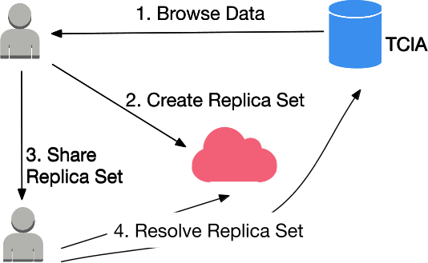
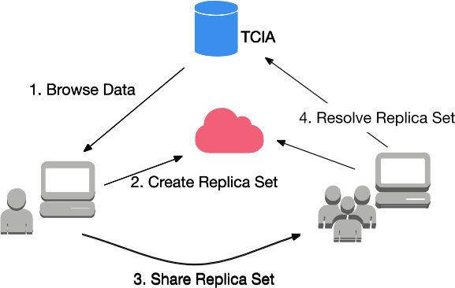
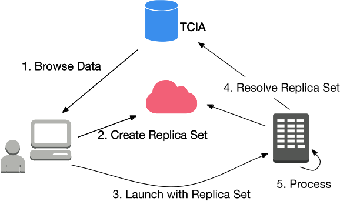

********
Use case
********

Data Sharing is cited as a major impediment to progress in Precision Medicine. MEDIator has an objective of data sharing
during research. It is similar to Dropbox/Box pattern for sharing file or folders. MEDIator does not use file name,
as data is rarely organized as files and filenames. It Relies on metadata used during search. It provides an API that
allows you to create and download ‘links’ using this metadata.

Replica Sets
############

Replica sets is the key concept that drives MEDIator. Research data is addressed via metadata. Metadata is used to
search, locate and download data. Replica Set is a combination of metadata that uniquely identifies the data of interest.

MEDIator offers CRUD APIs for Replica Sets and APIs to resolve Replica Sets and access the data.

The Cancer Imaging Archive (TCIA) encourages and supports cancer-related open science communities by hosting and
managing the data archive, and relevant resources to facilitate collaborative research. Hence, MEDIator has been
primarily implemented with TCIA to begin with.

Research Use case
#################

Researcher wants to share a subset of TCIA managed data with collaborator.

Orchestrate this data sharing from a research workstation.

Incorporate this in batch runs of data analysis pipelines.

