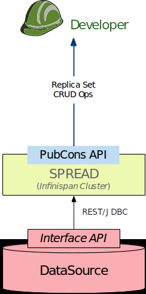

********************************************************
Data Source Management (Formerly known as Interface API)
********************************************************

Data Source Management for Users
################################

Data source management API integrates with the data sources for data retrieval. As the original interface of the data
sources, it was initially called as the Interface API. It utilizes access mechanisms provided by remote data sources, as
a mean to query and retrieve the raw data.

Additional functionality of download tracking and near duplicate detection have been proposed and implemented by
MEDIator in addition to the bare-bone data download offered by the data source providers. These include,

i) download changes since the previous downloads

ii) resume or Update.

Data Source Management for Developers
#####################################

Data source management refers to the management of the original data sources replicated by MEDIator. The implementation
of the data source management is often offered by the data source providers themselves.

Relevant classes can be found in the package: ds_mgmt.

Data source management module manages the data sources themselves.

The relevant interfaces and implementations are often provided by the data sources or the data providers, and hence
orthogonal to MEDIator. However, a TCIA data source management RESTful interface and implementation are included.

