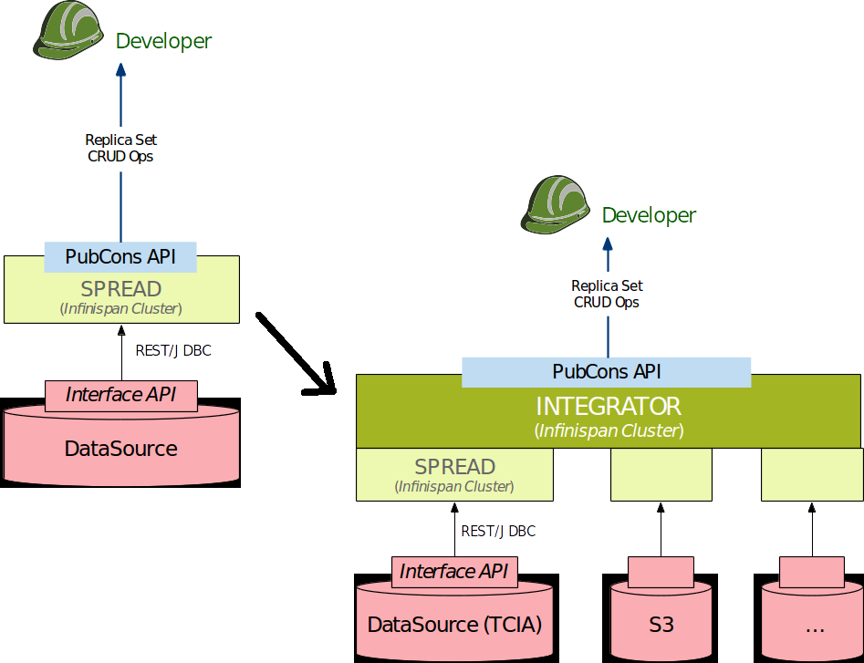

**********
Integrator
**********

Integrator for Users
####################
Integrator interacts with virtual data stores that integrate relevant public/private repositories. It integrates
multiple heterogeneous data sources into MEDIator. It provides a meta map and maps for each of the sources contributing
to the replica set. It allows the users to access relevant information for each of the entry at a coarse granularity.

Integrator for Developers
#########################

Relevant classes of the Integrator implementation can be found in the package: integrator. ReplicaSetsIntegrator is a
singleton that manages integration of all the data sources for the replica set management. Hence, ReplicaSetsIntegrator
is a single entity that has a one-to-many relationship with the data sources of MEDIator for the replicaset management.

