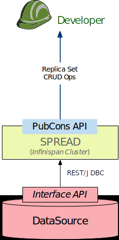
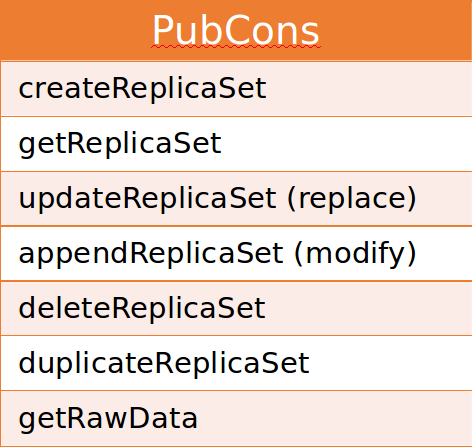

******************************************************
Replica Set Management (Formerly known as PubCons API)
******************************************************

PubCons for Users
#################

PubCons (Publish-Consume Replica Sets) is an interface specific to each data source. Customization via metadata mappings.

API parameters include

i) userID

ID of the user who created the replica set. This serves as the key of the map of replicas for the user

ii) replicaSetID.

ID of the replica set.

PubCons consists of multi-hierarchical maps for efficient execution in a large-scale production environment. Boolean
flags to indicate existence of entries at a certain granularity.

User facing CRUD REST API

    C  Create

    R  Retrieve

    U  Update

    D  Delete

PubCons for Developers
######################
Relevant classes can be found in the package: rs_mgmt.

Replicaset management module manages the replica sets pointing to each of the data sources.

ReplicaSetHandlers are implemented for each of the data sources that are federated by MEDIator. The ReplicaSetHandlers
offer an internal implementation of the replica sets management.

ReplicaSetManagers are the core REST APIs of MEDIator. They leverage the ReplicaSetHandlers to manage the replica sets
of each of the data sources. There is a one-to-one mapping between the ReplicaSetManager api implementations and the
data sources.

TciaReplicaSetManager provides the REST API for managing the TCIA replica sets. Relevant documentation can be found in
the class as the method-level comments.
